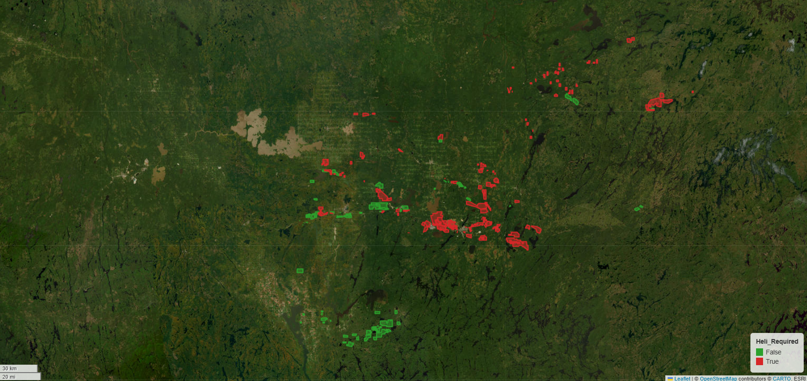
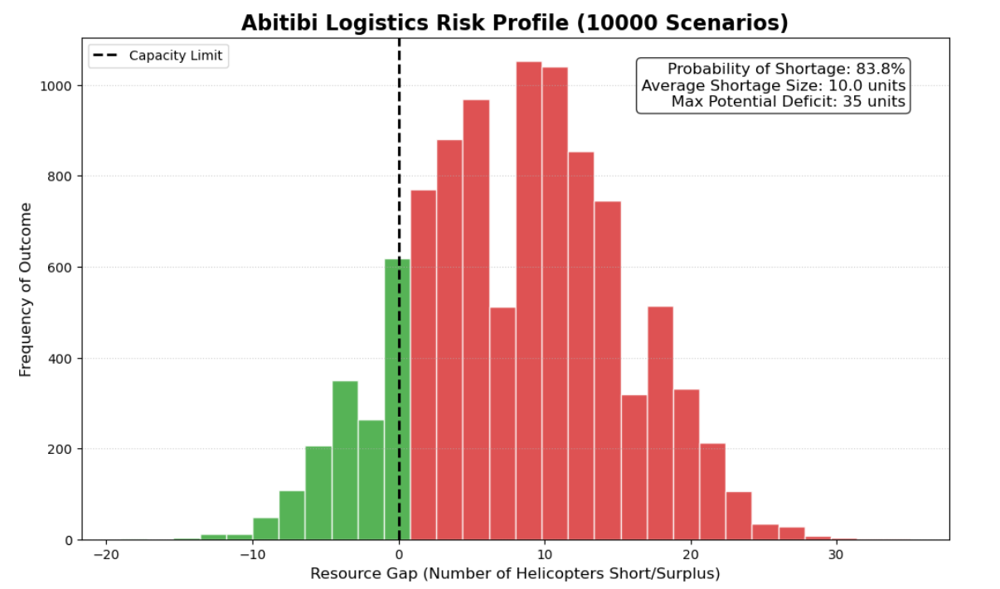

# Abitibi-Témiscamingue: Helicopter Logistics & Risk Analysis

Project Overview
This project provides a data-driven framework for quantifying helicopter demand in the mineral exploration sector. By intersecting provincial wetland rutting sensitivity data with active diamond drilling exploration authorizations (ATIs), this model identifies logistical bottlenecks before they impact field operations.

Key Features
Spatial Analysis: Automated identification of "Helicopter-Only" programs based on rutting potential.

Risk Modeling: A 10,000-scenario Monte Carlo simulation to predict fleet shortages.

Stochastic Variables: Accounts for regional fleet volatility (maintenance/SOPFEU) and project activation rates.

The Findings
The simulation indicates a near-certain probability of logistical failure under current regional fleet assumptions. In the most likely scenarios, the Abitibi region faces a deficit of 5 to 20 aircraft, justifying the immediate mobilization of external resources to prevent drill-rig downtime.

